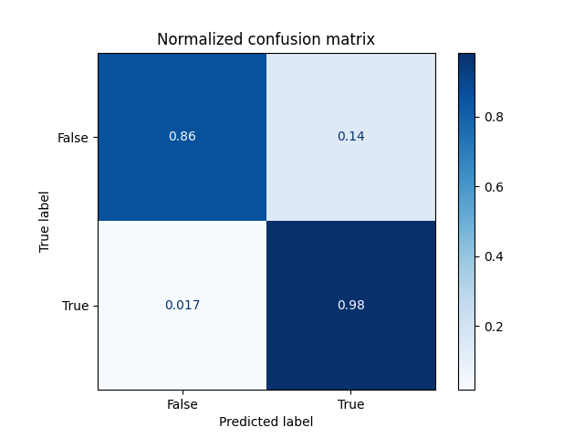

# Deep Learning Lab3

## 1. Introduction

This lab is to implement ResNet to analysis acute lymphoblastic leukemia. We need to use ResNet to distinguish the different between normal cells and leukemia cells. Same as previous lab, I provide arguments interface to control training easily. Beside training script and plotting, which generates accuracy curve about three models and evaluating interface, which generates test result csv to upload **Kaggle**.

```
├── train.py
├── eval.py
└── plot.py
```

### A. How to use

#### train.py

This script for training. It will store best model weights in `./storage/latest/`.

```
usage: train.py [-h] [-m MODEL] [-e EPOCHS] [-b BATCH_SIZE] [-o OPTIMIZER] [-r LEARNING_RATE] [-mm MOMENTUM] [-wd WEIGHT_DECAY]

optional arguments:
  -h, --help            show this help message and exit
  -m MODEL, --model MODEL
                        Model (ResNet18, ResNet50, ResNet152)
  -e EPOCHS, --epochs EPOCHS
                        Number of epochs
  -b BATCH_SIZE, --batch_size BATCH_SIZE
                        Batch size
  -o OPTIMIZER, --optimizer OPTIMIZER
                        Optimizer
  -r LEARNING_RATE, --learning_rate LEARNING_RATE
                        Learning rate
  -mm MOMENTUM, --momentum MOMENTUM
                        Momentum for SGD
  -wd WEIGHT_DECAY, --weight_decay WEIGHT_DECAY
                        Weight dacay for optimizer
example:
	python3 train.py -m ResNet18 -e 20 -b 32 -o sgd
```

#### eval.py

This script will generate test csv to upload kaggle and generate confusion matrix.

```
usage: eval.py [-h] [-c] [-d USE_DEVICE] [-b BATCH_SIZE] -m MODEL_PATH [-a ARCHITECTURE]

optional arguments:
  -h, --help            show this help message and exit
  -c, --use_cpu         Only use cpu
  -d USE_DEVICE, --use_device USE_DEVICE
                        Specific gpu
  -b BATCH_SIZE, --batch_size BATCH_SIZE
                        Batch size
  -m MODEL_PATH, --model_path MODEL_PATH
                        The model data path
  -a ARCHITECTURE, --architecture ARCHITECTURE
                        The architecture for test (test18, test50, test152)
example:
	python3 eval.py -a test18 -b 32 -m ...
```

#### plot.py

This script will generate comparison accuracy curve for three models.

```
usage: plot.py [-h] [-f FOLDER]

optional arguments:
  -h, --help            show this help message and exit
  -f FOLDER, --folder FOLDER
                        The folder contains three models
example:
	python3 plot -f ...
```


## 2. Implementation Details

### A. The details of your model (ResNet)

There are two major class, BasicBlock and BottleneckBlock for setup ResNet network.

#### Block Classes

```python3
class BasicBlock(nn.Module):
    def __init__(
        self,
        in_channels: int,
        out_channels: int,
        stride: int = 1,
        expansion: int = 1,
        down_sample: nn.Module = None,
        activation: nn.modules.activation = nn.ReLU(inplace=True)
    ) -> None:
        super(BasicBlock, self).__init__()

        self.expansion = expansion
        self.activation = activation
        self.down_sample = down_sample

        # architecture

        self.block = nn.Sequential(
            nn.Conv2d(
                in_channels=in_channels,
                out_channels=out_channels,
                kernel_size=3,
                stride=stride,
                padding=1,
                bias=False
            ),
            nn.BatchNorm2d(out_channels),
            activation,
            nn.Conv2d(
                in_channels=out_channels,
                out_channels=out_channels * self.expansion,
                kernel_size=3,
                padding=1,
                bias=False
            ),
            nn.BatchNorm2d(out_channels * self.expansion)
        )

    def forward(self, inputs: TensorDataset) -> Tensor:
        outputs = self.block(inputs)

        residual = inputs
        if self.down_sample:
            residual = self.down_sample(residual)

        outputs = self.activation(outputs + residual)

        return outputs
```

```python
class BottleneckBlock(nn.Module):
    def __init__(
        self,
        in_channels: int,
        out_channels: int,
        stride: int = 1,
        expansion: int = 4,
        down_sample: nn.Module = None,
        activation: nn.modules.activation = nn.ReLU(inplace=True)
    ) -> None:
        super(BottleneckBlock, self).__init__()

        self.expansion = expansion
        self.activation = activation
        self.down_sample = down_sample

        # architecture

        self.block = nn.Sequential(
            nn.Conv2d(
                in_channels=in_channels,
                out_channels=out_channels,
                kernel_size=1,
                bias=False
            ),
            nn.BatchNorm2d(out_channels),
            activation,
            nn.Conv2d(
                in_channels=out_channels,
                out_channels=out_channels,
                kernel_size=3,
                padding=1,
                stride=stride,
                bias=False
            ),
            nn.BatchNorm2d(out_channels),
            activation,
            nn.Conv2d(
                in_channels=out_channels,
                out_channels=out_channels * expansion,
                kernel_size=1,
                bias=False
            ),
            nn.BatchNorm2d(out_channels * expansion)
        )

    def forward(self, inputs: TensorDataset) -> Tensor:
        outputs = self.block(inputs)

        residual = inputs
        if self.down_sample:
            residual = self.down_sample(residual)

        outputs = self.activation(outputs + residual)

        return outputs
```

- There is a special arguent in contructor `down_sample` because I have to ensure input image size and output image size are the same. In ResNet, model contains serveral blocks in series. Therefore, ensuring I/O image size is important.

#### ResNet

```python
class ResNet(nn.Module):
    def __init__(
        self,
        block: Type[Union[BasicBlock, BottleneckBlock]],
        layer_blocks: List[int],
        expansion: int,
        num_classes: int
    ) -> None:
        super(ResNet, self).__init__()

        self.current_channels = 64
        self.expansion = expansion

        # architecture

        self.conv_1 = nn.Sequential(
            nn.Conv2d(
                in_channels=3,
                out_channels=64,
                kernel_size=7,
                stride=2,
                padding=3,
                bias=False
            ),
            nn.BatchNorm2d(64),
            nn.ReLU(inplace=True),
            nn.MaxPool2d(
                kernel_size=3,
                stride=2,
                padding=1
            )
        )

        self.conv_2 = self.__make_layer(
            block=block,
            num_of_blocks=layer_blocks[0],
            in_channels=64
        )

        self.conv_3 = self.__make_layer(
            block=block,
            num_of_blocks=layer_blocks[1],
            in_channels=128,
            stride=2
        )

        self.conv_4 = self.__make_layer(
            block=block,
            num_of_blocks=layer_blocks[2],
            in_channels=256,
            stride=2
        )

        self.conv_5 = self.__make_layer(
            block=block,
            num_of_blocks=layer_blocks[3],
            in_channels=512,
            stride=2
        )

        self.classify = nn.Sequential(
            nn.AdaptiveAvgPool2d((1, 1)),
            nn.Flatten(),
            nn.Linear(512 * self.expansion, num_classes)
        )

    def forward(self, inputs: TensorDataset) -> Tensor:
        partial_result = inputs
        for i in range(1, 6):
            partial_result = getattr(self, f'conv_{i}')(partial_result)
        return self.classify(partial_result)

    def __make_layer(
        self,
        block: Type[Union[BasicBlock, BottleneckBlock]],
        num_of_blocks: int,
        in_channels: int,
        stride: int = 1
    ) -> nn.Sequential:
        """
        Make a layer with given block module
        :param block: block module to be used
        :param num_of_blocks: number of block layers
        :param in_channels: number od block input channels
        :param stride: stride
        """

        down_sample = None
        out_channels = in_channels * self.expansion
        if stride != 1 or self.current_channels != out_channels:
            down_sample = nn.Sequential(
                nn.Conv2d(
                    in_channels=self.current_channels,
                    out_channels=out_channels,
                    kernel_size=1,
                    stride=stride,
                    bias=False
                ),
                nn.BatchNorm2d(out_channels)
            )

        layers = [
            block(
                in_channels=self.current_channels,
                out_channels=in_channels,
                stride=stride,
                down_sample=down_sample
            )
        ]

        # update and it will be used for next block layer
        self.current_channels = out_channels

        # in_channels:  in order to connect with prev block,
        #               input channel equals out channels
        # out_channels: block module has expansion,
        #               output channel equals input channels

        layers += [
            block(
                in_channels=out_channels,
                out_channels=in_channels,
            )
            for _ in range(1, num_of_blocks)
        ]

        return nn.Sequential(*layers)
```

- ResNet class supports using different blocks and the number of blocks in each layer to implement different architecture of ResNet.
- Private classmethod `self.__make_layer` is to build one layer for model. In method, I need to control whether using `down_sample` or not for builing blocks.Apart from first block in each layer, the other blocks I/O image size are the same, so it does not use `down_sample`.

### B. The details of your DataLoader

```python
class LeukemiaLoader(data.Dataset):
    def __init__(
        self,
        mode: str,
        root_path: str = './new_dataset'
    ) -> None:
        """
        :param mode: which mode dataset (train, valid, test)
        :param root_path: root path for dataset
        """

        super(LeukemiaLoader, self).__init__()

        self.mode = mode
        self.root_path = root_path
        self.img_path_list, self.label_list = self.__get_data()

        self.transform = transforms.RandomOrder([
            transforms.RandomRotation(degrees=20),
            transforms.RandomHorizontalFlip(p=0.5),
            transforms.RandomVerticalFlip(p=0.5)
        ])

        self.to_tensor = transforms.Compose([
            transforms.CenterCrop(350),
            transforms.Resize([350, 350]),
            transforms.ToTensor(),
        ])

    def __len__(self) -> int:
        return len(self.img_path_list)

    def __getitem__(self, index: int) -> Tuple[Tensor, int]:
        label = self.label_list[index]
        img = Image.open(self.img_path_list[index])
        if self.mode == 'train':
            img = self.transform(img)
        img_data = self.to_tensor(img)
        return img_data, label

    def __get_data(self) -> Tuple[List[str]]:
        if self.mode == 'train':
            df = pd.read_csv(f'{self.root_path}/train.csv')
        elif self.mode == 'valid':
            df = pd.read_csv(f'{self.root_path}/valid.csv')
        elif self.mode == 'test18':
            df = pd.read_csv(f'{self.root_path}/resnet_18_test.csv')
        elif self.mode == 'test50':
            df = pd.read_csv(f'{self.root_path}/resnet_50_test.csv')
        elif self.mode == 'test152':
            df = pd.read_csv(f'{self.root_path}/resnet_152_test.csv')
        else:
            raise ValueError(f'Does not support {self.mode}')

        img_path_list = df['Path'].to_list()
        try:
            label_list = df['label'].to_list()
        except:
            label_list = [0 for _ in range(len(img_path_list))]

        return img_path_list, label_list

```

-   constructor: define transformations and load data from csv.
-   \__len__: return dataset length.
-   \__getitem__: define operation about get image data according index.
-   __get_data: according csv load data and transform to list.

### C. Describing your evaluation through the confusion matrix


After serveral times training, the accuracy of distinguishing leukemmia cells is about to 100%, but the accuracy of distinguishing normal cells is lower. Therefore, I will use accuracy of distinguishing  normal cells to evaluate model is good or bad.

## 3. Data Preprocessing

### A. How you prepocessed your data?

```python
    # define transformation in contructor
  	self.transform = transforms.RandomOrder([
        transforms.RandomRotation(degrees=20),
        transforms.RandomHorizontalFlip(p=0.5),
        transforms.RandomVerticalFlip(p=0.5)
    ])

    self.to_tensor = transforms.Compose([
        transforms.CenterCrop(350),
        transforms.Resize([350, 350]),
        transforms.ToTensor(),
    ])
   	# end define

def __getitem__(self, index: int) -> Tuple[Tensor, int]:
    label = self.label_list[index]
    img = Image.open(self.img_path_list[index])
    if self.mode == 'train':
    		img = self.transform(img)
    img_data = self.to_tensor(img)
    return img_data, label
```

-   Transform is for data preprocessing in training. The major way to increase data strength are **rotation**, **flip**.
-   To_tensor is two steps transformation. First is to crop cells and enlarge cell ratio about image. Second is to transform (H, W, C) to (C, H, W).

### B. What makes your method special?

In my opinion, the most special method is `CenterCrop`, because it increases the ratio of cell in image easily. In other words, it enlarges the cell image resolution.

Other students will use rotation and flip to increase image strength. The different part between me and others is `CenterCrop`.

## 4. Experimental results

### A. The highest testing accuracy

|   ResNet18    |   |
| :-----------: | -------------------------------------------- |
| **ResNet50**  |   |
| **ResNet152** |  |

Above is my best accuracy in each Kaggle competition. The best accuracy is **ResNet18**.

-   epochs: 120
-   batch size: 32
-   optimizer: SGD
-   learning rate: 0.001
-   Momentum: 0.9
-   weight decay: 0.00001

### B. Comparison figures

This is accuracy curve with three models. Because of three models with different epochs, I only show last 40 epochs limit by ResNet152 (epochs 40). Valid test always oscillates up and down, but accuracy will go up.


This is confusion matrix about three models. The distinguishing leukemia part has better accuracy.  The complete accuracy is limited by distinguishing normal cells.

|                         **ResNet18**                         |                         **ResNet50**                         |                        **ResNet152**                         |
| :----------------------------------------------------------: | :----------------------------------------------------------: | :----------------------------------------------------------: |
|  |  |  |


## 5. Disscussion


