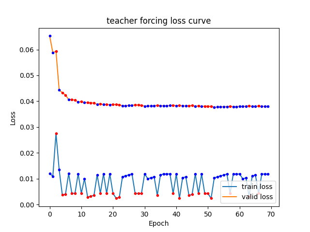
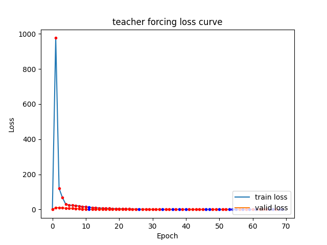
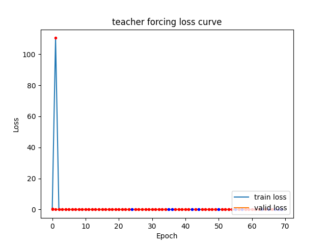
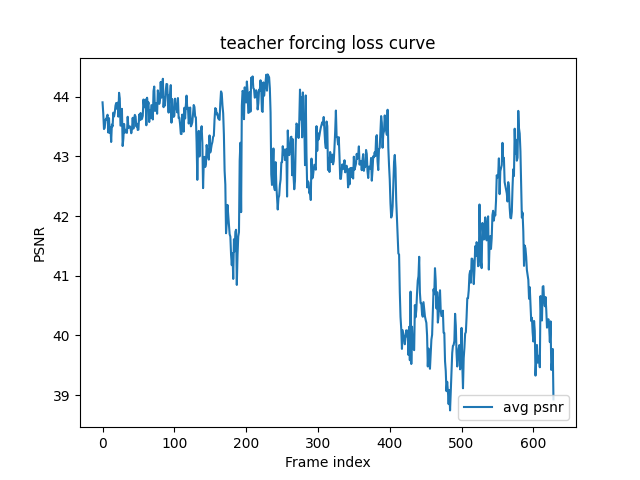

# Deep Learning Lab4

## 1. Introduction

Our objective is to implement conditional video predictor in a VAE-based model. To improvce model performance, we add teacher forcing to fix continuous prediction. Another improvement is kl annealing strategy to change KL divergence ratio.

## 2. Implementation details

### A. How do you write your training protocol

```python
def training_one_step(self, img, label, adapt_TeacherForcing):
    total_loss = 0
    img = img.permute(1, 0, 2, 3, 4)  # change tensor into (seq, B, C, H, W)
    label = label.permute(1, 0, 2, 3, 4)  # change tensor into (seq, B, C, H, W)

    last_frame_feat = self.frame_transformation(img[0])
    for i, (img_per_frame, label_per_unit) in enumerate(zip(img, label), start=1):
        # skip first frame
        if i == 1:
        		continue

        # Encode input image and label
        frame_feat = self.frame_transformation(img_per_frame)
        label_feat = self.label_transformation(label_per_unit)

        # Predict latent Gaussian distribution parameters
        z, mu, logvar = self.Gaussian_Predictor(frame_feat, label_feat)

        # Combine latent variable for decoder input
        combined_latent = self.Decoder_Fusion(last_frame_feat, label_feat, z)

        # Generate output
        decoded_output = self.Generator(combined_latent)

        # Calculate reconstruction loss (MSE)
        mse_loss = self.mse_criterion(decoded_output, img_per_frame)

        # Calculate KL divergence loss
        kl_loss = kl_criterion(mu, logvar, self.train_vi_len)

        # Total loss
        frame_total_loss = mse_loss + self.kl_annealing.get_beta() * kl_loss

        total_loss += frame_total_loss

        if adapt_TeacherForcing:
        		last_frame_feat = self.frame_transformation(img_per_frame)
        else:
        		last_frame_feat = self.frame_transformation(decoded_output)

    self.optim.zero_grad()
    total_loss.backward()
    self.optimizer_step()

    return total_loss.detach().cpu().item()
```

According to illustratte algorithm from TA in pdf, there are two part in training protocol. Using current frame and label to get current frame latent sample through Posterior Predictor (`Gaussian_Predictor`). Taking current latent sample, last frame, and current label feature to predict current current frame. There are two parts in loss calculation, MSE loss and KL divergence. There is a trick about loss backpropagation. I run step in each frame calculation, but loss too small to get gradient vanish originally. Therefore, I total loss in each frame and run step once to solve this problem. 

### B. How do you implement reparameterization tricks

```python
def reparameterize(self, mu, logvar):
    std = torch.exp(0.5 * logvar)
    eps = torch.randn_like(std)
    return eps * std + mu
```


### C. How do you set your teacher forcing strategy

```python
def teacher_forcing_ratio_update(self):
    if self.current_epoch >= self.tfr_sde and self.current_epoch % self.tfr_sde == 0:
        self.tfr = max(self.tfr - self.tfr_d_step, 0.3)
```

My strategy is ratio decay in every `self.tfr_sde` and settting minimize value `0.3`.

### D. How do you set your kl annealing ratio

```python
class kl_annealing():
    def __init__(self, args, current_epoch=0):
        self.args = args
        self.current_epoch = current_epoch
        self.beta = 0.0  # Initialize beta value

        self.kl_anneal_type = args.kl_anneal_type
        self.kl_anneal_cycle = args.kl_anneal_cycle
        self.kl_anneal_ratio = args.kl_anneal_ratio

    def update(self):
        self.current_epoch += 1
        self.beta = self.frange_cycle_linear()

    def get_beta(self):
        return self.beta

    def frange_cycle_linear(self, start=0.0, stop=1.0):
        if self.kl_anneal_type == 'Cyclical':
            current_cycle = self.current_epoch % self.kl_anneal_cycle
            current_cycle /= self.kl_anneal_cycle
        elif self.kl_anneal_type == 'Monotonic':
            current_cycle = min(self.current_epoch / self.kl_anneal_cycle, 1.0)
        elif self.kl_anneal_type == 'None':
            return 1.0

        current_cycle = min(current_cycle / self.kl_anneal_ratio, 1.0)
        return start + (stop - start) * current_cycle
```

There are three different kl annealing ratio update method.

-   Cyclical: the beta will cyle from 0 to 1 in every `self.kl_annealing_cycle` epochs.
-   Monotonic: the beta will increase from 0 to 1 in `self.kl_annealing_cycle` epochs.
-   None: always return one.

## 3. Analysis & Disscusssion

### A. Plot teacher forcing ratio



There are two line, blue is train loss, orange is valid loss. Each point on line shows teacher forcing true (red) or false (blue).

If teacher forcing is true, train loss will increase a little, but valid loss will decrease more.

### B. Plot the loss curve while training with different setting

|                           Cyclical                           |                          Monotonic                           |                             None                             |
| :----------------------------------------------------------: | :----------------------------------------------------------: | :----------------------------------------------------------: |
|  |  |  |

In my experiment, cyclical annealing is the best. In monotonic annealing on epoch two has considerable train loss. The last result in monotonic and none are similar, average test PSNR are 18.

### C. Plot the PSNR per frame diagram in validation dataset



### D. Derivate conditional VAE formula

$$
\begin{aligned}
\int q(z|x, c) \log p(x|c; \theta) dz
&= \int q(z|x, c) \log(\frac{p(x, z|c; \theta)}{p(z|x, c; \theta)})dz \\
&= \int q(z|x, c) \log p(x, z|c; \theta)dz - \int q(z|x, c) \log p(z|x, c; \theta)dz \\
&= \int q(z|x, c) \log p(x, z|c; \theta)dz - \int q(z|x, c) \log q(z|c)dz + \\
&\ \ \ \ \int q(z|x, c) \log q(z|c)dz - \int q(z|x, c) \log p(z|x, c; \theta)dz \\
&= \int q(z|x, c) \log(\frac{p(x, z|c; \theta)}{q(z|c)})dz + \int q(z|x, c) \log(\frac{q(z|c)}{p(z|x, c,; \theta)})dz \\
&= L_b(x, c, q, \theta) + KL(q(z|c)||p(z|x, c; \theta))
\end{aligned}
$$

The KL divergence is non-negative, $KL(q || p) \ge 0$, it follows that $\log p(x|c; \theta) \ge L_b(x, c, q, \theta)$, with equality iff $q(z|c) = p(z|x, c; \theta)$.

It means $L_b(x, c, q, \theta)$ is a lower bound on $\log p(x|c; \theta)$

$$
\begin{aligned}
L_b(x, c, q, \theta) =& \int q(z|c) \log(\frac{p(x, z|c; \theta)}{q(z|c)})dz \\
=& \int q(z|c) \log(\frac{p(x|z, c; \theta)p(z|c)}{p(z|c)})dz \\
=& \int q(z|c) \log p(x|z, c; \theta)dz + \int q(z|c) \log p(z|c)dz - \int q(z|c) \log q(z|c)dz \\
=& E_{z~q(z|x, c; \phi)} \log p(x|z, c; \theta) - KL(q(z|x, c; \phi) || p(z|c))
\end{aligned}
$$
